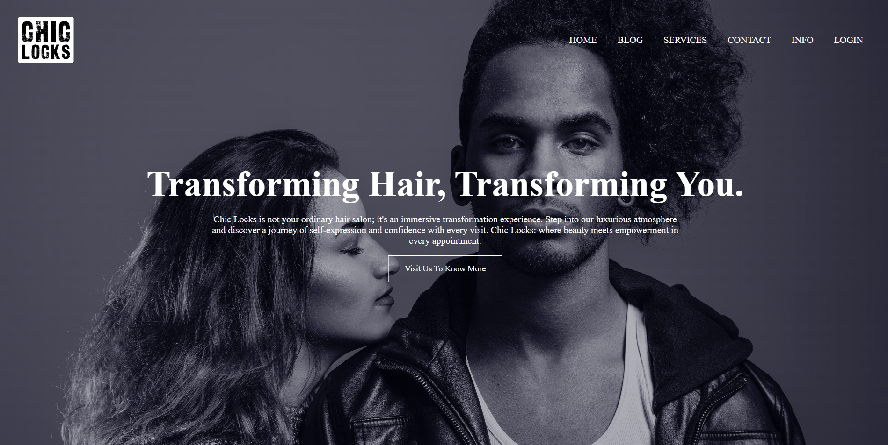
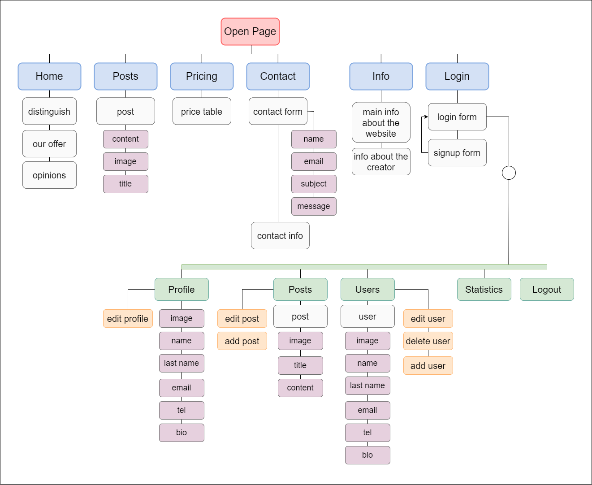
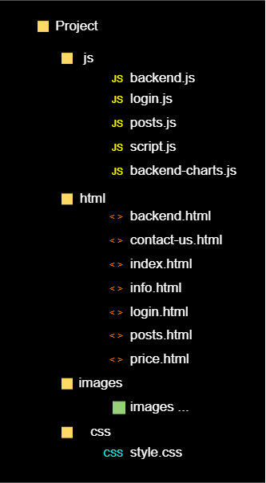

# Hair Salon Website
ChickLocks hair salon website created using HTML, CSS, JavaScript

# Table of Content
* [General info](#general-info)
* [Technologies](#technologies)
* [Page structure](#page-structure)
* [File structure](#file-structure)
* [Structure and content](#structure-and-content)
* [Website URL](#website-url)
* [Planned changes](#planned-changes)
* [Additional info](#additional-info)
* [Author](#author)
## General info:
The task of the **ChicLocks** website is to create a modern and attractive online platform, which
the main goal is to provide comprehensive hairdressing services to clients, both before and after
visit to the salon. The website is designed to build a strong brand identity, making it easy for customers
browsing services, getting to know information about the salon, keeping in touch.
## Technologies:
* HTML
* CSS
* JavaScript
## Page structure:

## File structure:

## Structure and content

home.html

<h4>Title: "Chic Locks - Hair Salon in Łódź | Hair Salon in Łódź | Home Page"</h4>
<h4>External resources:</h4>
  <ul>
    <li> Font Awesome (version 6.4.2) for iconography.</li>
    <li> External CSS file ( style.css) for styling.</li>
    <li> External JavaScript file (script.js) for responsive navigation menu.</li>
  </ul>
<h4>Content</h4>

This is the home page. This page displays the features of the hair salon, salon services, and customer reviews. Home Page contains additional information about the salon, links to social media.

posts.html

<h4>Title: " Chic Locks - Salon Fryzjerski w Łodzi | Hair Salon in Łódź | Posts Page"</h4>
<h4>External resources:</h4>
  <ul>
    <li> Font Awesome (version 6.4.2) for iconography.</li>
    <li> External CSS file ( style.css) for styling.</li>
    <li> External JavaScript file (script.js and posts.js) for dynamic functionality, especially for
loading and displaying posts.</li>
  </ul>
<h4>Content</h4>

This page was created to display hair salon posts. These may be posts about discounts, new products in the salon or other messages addressed to the salon's customers.

price.html

<h4>Title: " Chic Locks - Salon Fryzjerski w Łodzi | Hair Salon in Łódź | Pricing Page"</h4>
<h4>External resources:</h4>
  <ul>
    <li> Font Awesome (version 6.4.2) for iconography.</li>
    <li> External CSS file ( style.css) for styling.</li>
    <li> External JavaScript file (script.js) for responsive navigation menu.</li>
  </ul>
<h4>Content</h4>

This page effectively presents information about the prices of salon services in a structured and attractive way
visually format.

contact-us.html

<h4>Title: " Chic Locks - Salon Fryzjerski w Łodzi | Hair Salon in Łódź | Contact Page"</h4>
<h4>External resources:</h4>
  <ul>
    <li> Font Awesome (version 6.4.2) for iconography.</li>
    <li> External CSS file ( style.css) for styling.</li>
    <li> External JavaScript file (script.js) for responsive navigation menu.</li>
  </ul>
<h4>Content</h4>

This page facilitates user interaction with the salon through a comprehensive form
contact details, detailed location information and easy navigation.

info.html

<h4>Title: " Chic Locks - Salon Fryzjerski w Łodzi | Hair Salon in Łódź | Info Page"</h4>
<h4>External resources:</h4>
  <ul>
    <li> Font Awesome (version 6.4.2) for iconography.</li>
    <li> External CSS file ( style.css) for styling.</li>
    <li> External JavaScript file (script.js) for responsive navigation menu.</li>
  </ul>
<h4>Content</h4>

This page aims to offer informational content about the creator.

login.html

<h4>Title: " Chic Locks - Salon Fryzjerski w Łodzi | Hair Salon in Łódź | Login Page"</h4>
<h4>External resources:</h4>
  <ul>
    <li> Font Awesome (version 6.4.2) for iconography.</li>
    <li> External CSS file ( style.css) for styling.</li>
    <li> External JavaScript file (script.js and login.js) to handle login and registration processes and to
responsive menu functions.</li>
  </ul>
<h4>Content</h4>

This page provides user authentication features through login forms and
registration, includes responsive design and interactive elements for an effective experience
user.

backend.html

<h4>Title: " Chic Locks | User Panel""</h4>
<h4>External resources:</h4>
  <ul>
    <li> Font Awesome (version 6.4.2) for iconography.</li>
    <li> External CSS file ( style.css) for styling.</li>
    <li> External JavaScript file (backend.js) for backend functionality.</li>
  </ul>
<h4>Content</h4>

This page serves as a comprehensive admin panel for managing user profiles, posts and
other users, offering a responsive and functionally rich interface.
ractive elements for an effective experience
user.

## Website URL:
https://coderookie0.github.io/hair_salon_website/html/

## Additional info: 
This project is not commercial. The main goal of "Hair Salon Website" is to learn programming in HTML, CSS and JavaScript, understand syntax, layout and style rules, and improve my skills.
## Planned changes:
The main part of the project has been completed. I plan to develop this website by adding new functionalities, including: 
- the ability to book appointments
- the ability to add opinions after the visit
## Author: 
Maryia Shyliankova

**Last update: 29/01/2024**
